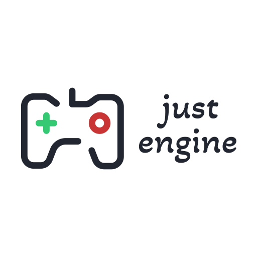

# Just Engine

Game engine for building canvas games in browser

<p align="center">
  
</p>

## Contents
  - [Examples](#examples)
  - [Prerequisites](#prerequisites)
  - [Local run for development](#-ocal-run-for-development) 
  - [Lint project](#lint-project)
  - [Run tests](#run-tests)
  - [Visualize bundle](#visualize-bundle)
  - [License](#license)
  - other items in progress
  <!-- - [Features](#features) -->
  <!-- - [Tutorials](#tutorials)-->
  <!-- - [Build For Production](#build-for-production) -->

## Examples

- [Sapper](https://danilchugaev.github.io/sapper/)

## Prerequisites

- [npm](http://npmjs.com)
- [Node.js](https://nodejs.org/en/download/)

## Local run for development

Clone the project

```bash
  git clone git@github.com:DanilChugaev/just-engine.git my-project
```

Go to the project directory

```bash
  cd my-project
```

Install dependencies

```bash
  npm install
```

Start the development server

```bash
  npm run dev
```

## Lint project

To lint code in project

```bash
 npm run lint
```

## Run tests

To run unit tests

```bash
 npm run test
```

To run it in change tracking mode (--watch mode)

```bash
 npm run test-watch
```

## Visualize bundle

To visualize and analyze your Rollup bundle

```bash
 npm run stats
```

## License

Matter.js is licensed under [The MIT License (MIT)](https://opensource.org/licenses/MIT)  
Copyright (c) 2022 Danil Chugaev

This license is also supplied with the release and source code.  
As stated in the license, absolutely no warranty is provided.